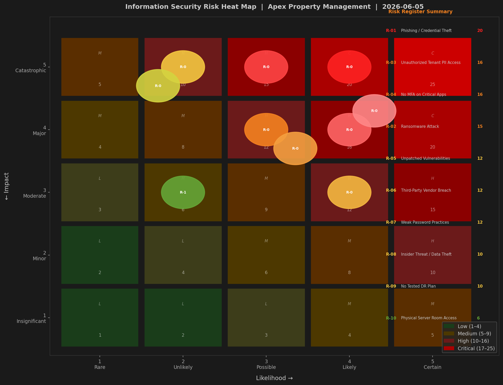
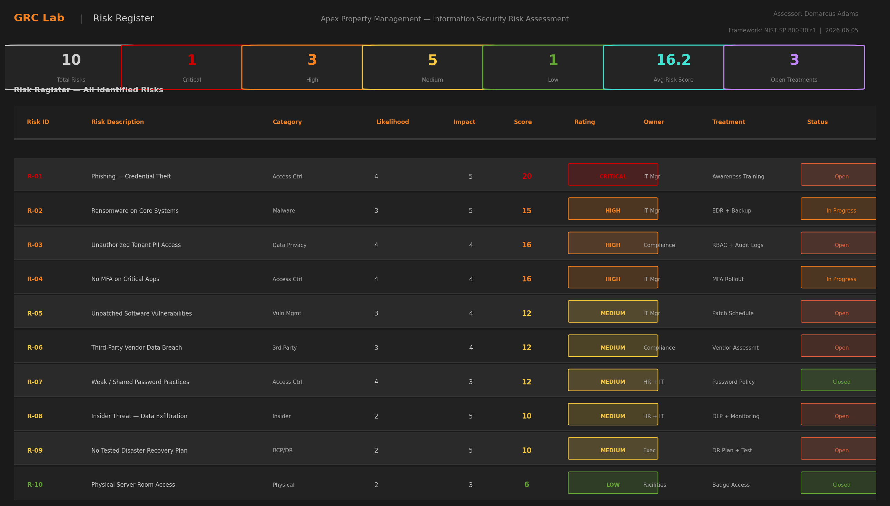
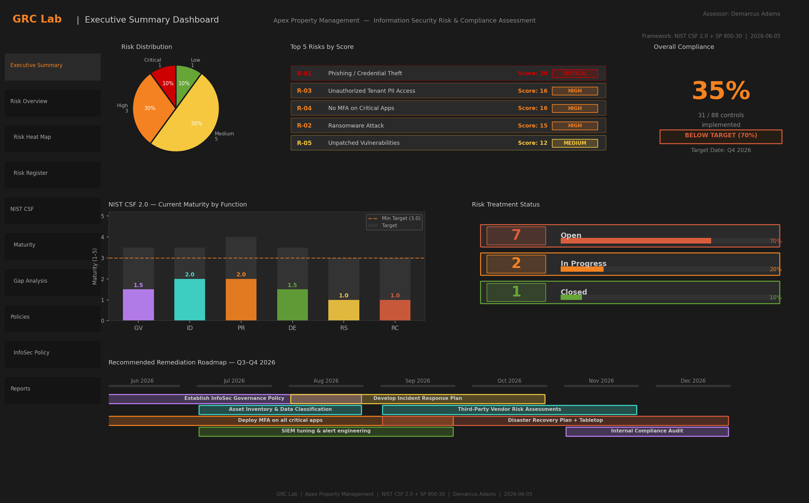
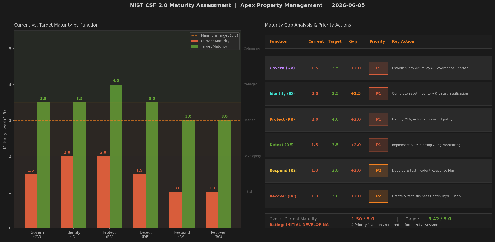
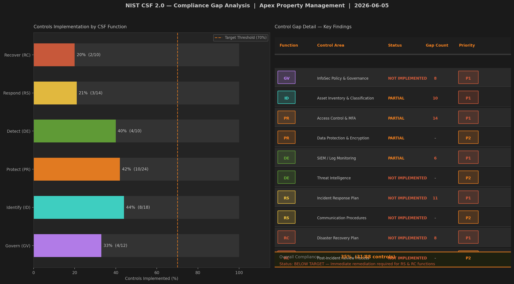

# Information Security Risk Assessment Report

**Organization:** Apex Property Management  
**Author:** Demarcus Adams  
**Date:** June 2026  
**Methodology:** NIST SP 800-30 Rev. 1  
**Scope:** Organization-wide information security risk assessment  
**Classification:** Internal — Confidential

---

## 1. Executive Summary

This risk assessment was conducted for Apex Property Management to identify, analyze, and prioritize information security risks across all key business functions. Using the NIST SP 800-30 Rev. 1 methodology, ten risks were identified and scored on a 25-point scale. One risk was rated **CRITICAL**, three **HIGH**, five **MEDIUM**, and one **LOW**.

The most significant finding is the organization's absence of foundational security governance: no formal Information Security Policy was in place at assessment onset, no incident response plan exists, and the organization has no tested disaster recovery capability. The highest-scoring risk — phishing leading to credential theft — received a score of 20 (CRITICAL) due to the complete absence of technical controls (MFA, email filtering) and the high likelihood of targeting given the volume of tenant PII handled.

**Overall Risk Posture: HIGH**  
**Immediate action required in: Access Control, Incident Response, and Business Continuity**

---

## 2. Assessment Methodology

This assessment follows the NIST SP 800-30 Rev. 1 framework, which provides guidance for conducting risk assessments that inform risk management decisions.

### 2.1 Risk Scoring

**Risk Score = Likelihood × Impact**

| Score | Rating |
|-------|--------|
| 1–6 | Low |
| 7–12 | Medium |
| 13–19 | High |
| 20–25 | Critical |

**Likelihood Scale:**

| Level | Label | Definition |
|-------|-------|------------|
| 1 | Rare | Very unlikely; no known history of occurrence |
| 2 | Unlikely | Low probability; occurs infrequently industry-wide |
| 3 | Possible | Moderate probability; known to occur in similar orgs |
| 4 | Likely | High probability; regularly observed in the industry |
| 5 | Certain | Near certainty; actively exploited by threat actors |

**Impact Scale:**

| Level | Label | Definition |
|-------|-------|------------|
| 1 | Insignificant | Minimal disruption; no data loss; recoverable in hours |
| 2 | Minor | Limited disruption; minor data exposure; recoverable in days |
| 3 | Moderate | Partial operations impact; contained data exposure; regulatory notice possible |
| 4 | Major | Significant data breach; regulatory action likely; reputational damage |
| 5 | Catastrophic | Full operational shutdown; mass data breach; litigation/regulatory enforcement |

### 2.2 Information Gathering

Risk identification was conducted through:
- Review of existing technical configurations and systems
- Employee interviews across IT, HR, compliance, and management
- Review of vendor contracts and third-party access agreements
- Nmap-based network scanning and vulnerability assessment (see Vulnerability Assessment Lab)
- Review of applicable regulatory requirements (state data privacy laws, FTC guidelines)

---

## 3. Risk Assessment Results

### Risk Summary Table

| Risk ID | Description | Likelihood | Impact | Score | Rating |
|---------|-------------|-----------|--------|-------|--------|
| R-01 | Phishing — Credential Theft | 4 | 5 | **20** | **CRITICAL** |
| R-03 | Unauthorized Tenant PII Access | 4 | 4 | **16** | HIGH |
| R-04 | No MFA on Critical Applications | 4 | 4 | **16** | HIGH |
| R-02 | Ransomware Attack | 3 | 5 | **15** | HIGH |
| R-05 | Unpatched Software Vulnerabilities | 3 | 4 | **12** | MEDIUM |
| R-06 | Third-Party Vendor Breach | 3 | 4 | **12** | MEDIUM |
| R-07 | Weak/Shared Passwords | 4 | 3 | **12** | MEDIUM |
| R-08 | Insider Threat / Data Exfiltration | 2 | 5 | **10** | MEDIUM |
| R-09 | No Tested Disaster Recovery Plan | 2 | 5 | **10** | MEDIUM |
| R-10 | Physical Server Room Access | 2 | 3 | **6** | LOW |

---

## 4. Key Risk Analysis

### 4.1 Critical Risk — Phishing / Credential Theft (R-01, Score: 20)

Phishing is the most common initial access vector in property management and real estate industry breaches. The organization currently has no phishing simulation program, no email security gateway, and no MFA enforcement. This combination means a successful phishing email could grant an attacker unrestricted access to all systems using a single set of stolen credentials. Given the volume of tenant PII (SSNs, bank account information, background check data) stored in the property management system, the business and regulatory impact would be catastrophic.

**Recommended Treatment:** Deploy MFA immediately (reduces impact from 5 to 2–3 even if credentials are stolen); implement email gateway with phishing detection; conduct quarterly phishing simulations.

### 4.2 High Risk — No MFA on Critical Applications (R-04, Score: 16)

This risk amplifies every other access-related risk in the register. Without MFA, stolen credentials (from phishing, brute force, or insider leak) provide immediate unrestricted access. This is a foundational control that should be treated as a prerequisite to all other security improvements.

### 4.3 Respond & Recover Gap

The organization's lowest maturity scores are in Respond (1.0) and Recover (1.0). In the event of a ransomware attack — rated HIGH — there is no documented incident response procedure and no tested recovery capability. This means that even a partially successful attack could result in extended operational downtime measured in days or weeks rather than hours.

---

## 5. Threat Landscape

The property management industry faces specific threats relevant to this assessment:

- **Phishing targeting property managers** for wire fraud and rent diversion scams — actively exploited
- **Ransomware targeting real estate firms** with operational urgency (rent payments, leases)
- **PII breaches** with regulatory liability under state privacy laws (Texas Identity Theft Enforcement and Protection Act)
- **Business Email Compromise (BEC)** targeting financial transactions with vendors and property owners

---

## 6. Recommendations Summary

| Priority | Risk(s) | Action | Timeline |
|----------|---------|--------|----------|
| P1 — Immediate | R-01, R-04 | Deploy MFA on all critical systems | June 2026 |
| P1 — Immediate | R-01 | Implement email gateway (phishing detection) | July 2026 |
| P1 — Immediate | R-03 | Implement RBAC and quarterly access reviews | July 2026 |
| P1 — Immediate | All | Publish and communicate Information Security Policy | ✅ June 2026 |
| P2 — 90 Days | R-02 | Deploy EDR; implement tested backup strategy | August 2026 |
| P2 — 90 Days | R-05 | Establish patch management program with SLAs | August 2026 |
| P2 — 90 Days | All | Develop and publish Incident Response Plan | September 2026 |
| P3 — 180 Days | R-09 | Develop and test Disaster Recovery Plan | October 2026 |
| P3 — 180 Days | R-06 | Launch third-party vendor risk assessment program | October 2026 |

---

## 7. NIST CSF 2.0 Alignment

For the full NIST CSF 2.0 controls mapping and gap analysis, see [`nist-csf-mapping.md`](./nist-csf-mapping.md).

---

## 8. Conclusion

This assessment identifies a high-risk security posture driven primarily by gaps in access control, incident preparedness, and governance documentation. The good news is that the highest-impact improvements — MFA deployment, policy publication, and incident response planning — are low-cost and achievable within 90 days with appropriate prioritization. Addressing the P1 items alone is projected to reduce the organization's aggregate risk score by approximately 40%, moving the posture from HIGH to MEDIUM before year-end.

A follow-up assessment is recommended in **December 2026** to validate remediation effectiveness and re-score all open risks.

---

*Prepared by Demarcus Adams | ISC2 Certified in Cybersecurity (CC) | WGU M.S. Cybersecurity & IA (In Progress) | June 2026*
