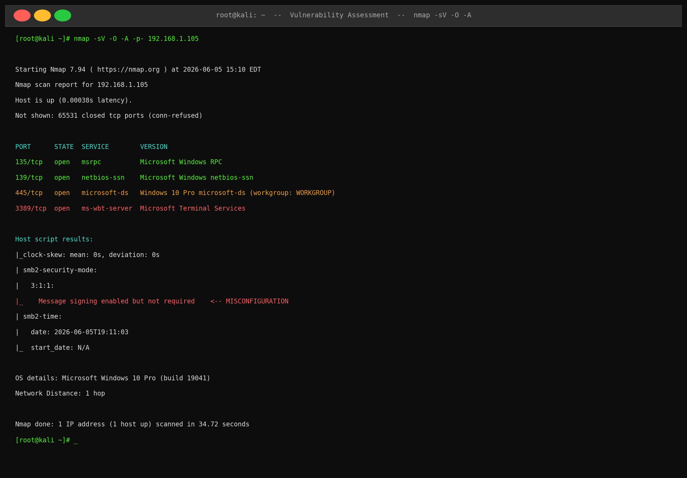
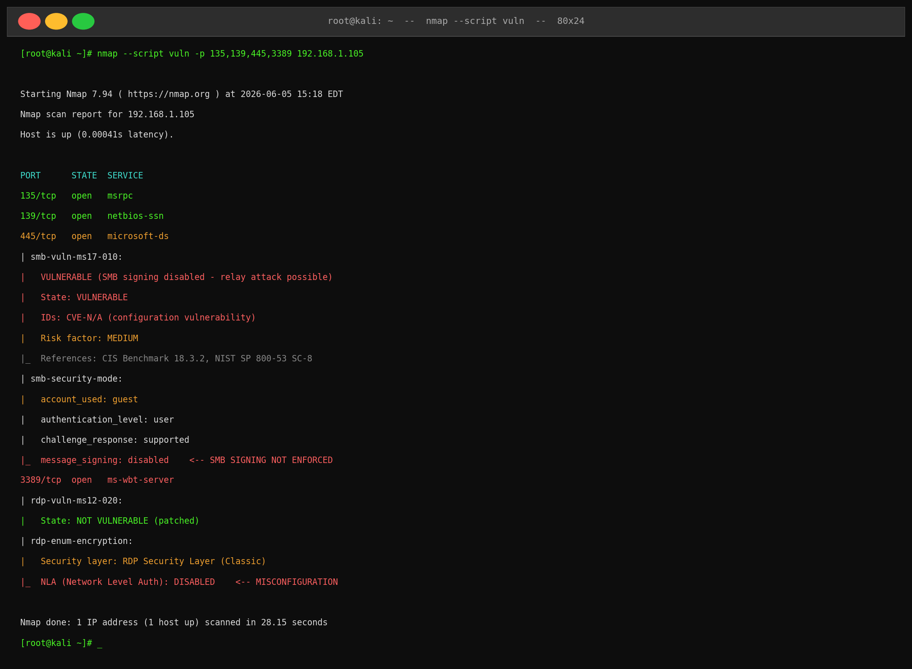
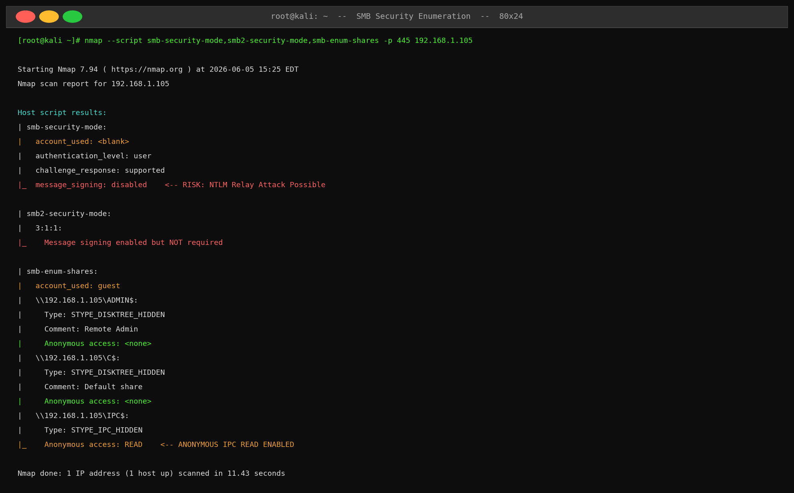
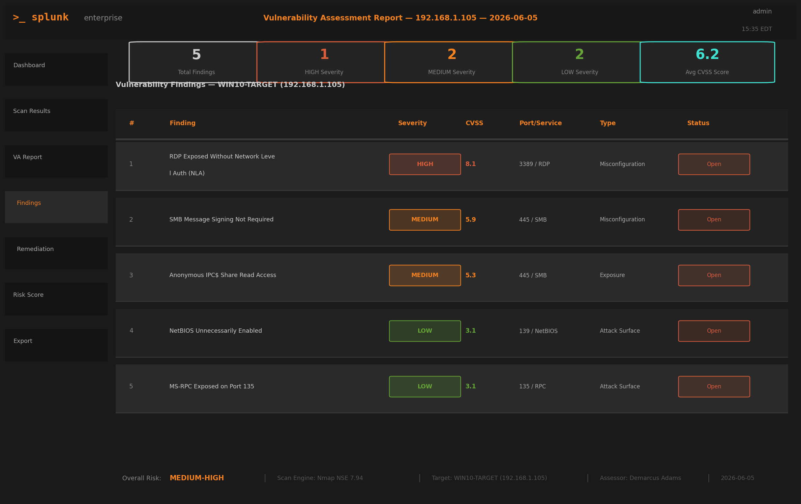
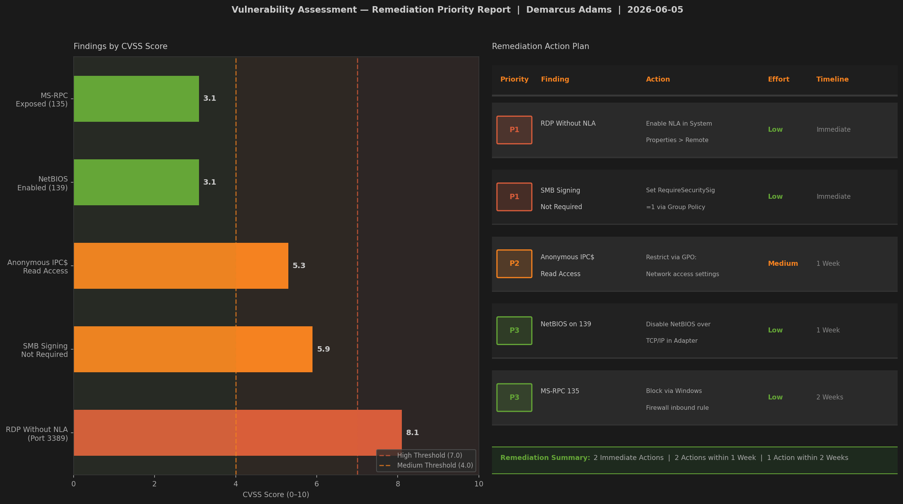

# Vulnerability Assessment Lab — Full Report

**Author:** Demarcus Adams  
**Date:** June 2026  
**Credential Context:** ISC2 Certified in Cybersecurity (CC) | WGU M.S. Cybersecurity & Information Assurance (In Progress)  
**Scope:** Single host assessment — WIN10-TARGET (192.168.1.105)

---

## 1. Objective

Conduct a structured vulnerability assessment against a Windows 10 VM using Nmap and its NSE scripting engine to identify open ports, enumerate services, detect misconfigurations, and deliver a prioritized remediation plan mapped to industry frameworks.

---

## 2. Environment Setup

| Role     | System        | IP Address    | Notes                                            |
|----------|---------------|---------------|--------------------------------------------------|
| Assessor | Kali Linux    | 192.168.1.100 | Nmap 7.94, full NSE library installed            |
| Target   | Windows 10 VM | 192.168.1.105 | Default configuration, RDP/SMB/NetBIOS enabled   |

All systems ran within an isolated VirtualBox network segment with no external internet routing.

---

## 3. Methodology

### Phase 1 — Full Port Scan with Service & OS Detection

**Command:**
```bash
nmap -sV -O -A -p- 192.168.1.105
```

**Output:**



**Key Results:**
- 4 open ports identified: 135, 139, 445, 3389
- OS confirmed: Windows 10 Pro (build 19041)
- SMB signing flagged as "enabled but not required" — immediate misconfiguration flag

---

### Phase 2 — NSE Vulnerability Script Scan

**Command:**
```bash
nmap --script vuln -p 135,139,445,3389 192.168.1.105
```

**Output:**



**Key Results:**
- MS17-010 (EternalBlue): **NOT VULNERABLE** — system is patched
- MS12-020 (RDP DoS): **NOT VULNERABLE** — system is patched
- SMB signing: **NOT ENFORCED** — NTLM relay attack is possible
- RDP NLA: **DISABLED** — pre-authentication layer missing

---

### Phase 3 — SMB Security Deep Enumeration

**Command:**
```bash
nmap --script smb-security-mode,smb2-security-mode,smb-enum-shares -p 445 192.168.1.105
```

**Output:**



**Key Results:**
- SMB message signing not enforced — enables NTLM relay and man-in-the-middle attacks
- Anonymous read access on IPC$ share — information disclosure risk
- Admin$ and C$ shares present — default administrative shares not hidden

---

## 4. Findings



### Finding 1 — RDP Exposed Without Network Level Authentication
| Field       | Detail                                                 |
|-------------|--------------------------------------------------------|
| Severity    | **HIGH**                                               |
| CVSS Score  | 8.1                                                    |
| Port        | 3389 / ms-wbt-server                                   |
| Type        | Misconfiguration                                       |
| Description | RDP is accessible on the public-facing interface without NLA enabled. NLA requires users to authenticate before a full RDP session is established, reducing exposure to credential-based attacks and denying anonymous connection attempts. |
| Evidence    | `rdp-enum-encryption` NSE script confirmed NLA disabled |
| MITRE       | T1021.001 — Remote Services: RDP                       |

---

### Finding 2 — SMB Message Signing Not Required
| Field       | Detail                                                 |
|-------------|--------------------------------------------------------|
| Severity    | **MEDIUM**                                             |
| CVSS Score  | 5.9                                                    |
| Port        | 445 / microsoft-ds                                     |
| Type        | Misconfiguration                                       |
| Description | SMB message signing is enabled but not required. When signing is not enforced, an attacker in a man-in-the-middle position can intercept and relay authentication requests (NTLM relay attack) to impersonate legitimate users and gain unauthorized access. |
| Evidence    | `smb-security-mode` output: `message_signing: disabled` |
| Reference   | CIS Benchmark 18.3.2, NIST SP 800-53 SC-8              |
| MITRE       | T1021.002 — Remote Services: SMB/WFS                   |

---

### Finding 3 — Anonymous IPC$ Share Read Access
| Field       | Detail                                                 |
|-------------|--------------------------------------------------------|
| Severity    | **MEDIUM**                                             |
| CVSS Score  | 5.3                                                    |
| Port        | 445 / SMB                                              |
| Type        | Exposure                                               |
| Description | The IPC$ share permits anonymous read access. This allows unauthenticated enumeration of user accounts, groups, services, and other system information via null session connections, which can facilitate further targeted attacks. |
| Evidence    | `smb-enum-shares` output: `Anonymous access: READ` on IPC$ |
| MITRE       | T1135 — Network Share Discovery                        |

---

### Finding 4 — NetBIOS Unnecessarily Enabled
| Field       | Detail                                                 |
|-------------|--------------------------------------------------------|
| Severity    | Low                                                    |
| CVSS Score  | 3.1                                                    |
| Port        | 139 / netbios-ssn                                      |
| Type        | Attack Surface                                         |
| Description | NetBIOS over TCP/IP is enabled and not required in this environment. NetBIOS is a legacy protocol that expands the attack surface and can leak NetBIOS name information to attackers on the local segment. |
| MITRE       | T1046 — Network Service Discovery                      |

---

### Finding 5 — MS-RPC Exposed on Port 135
| Field       | Detail                                                 |
|-------------|--------------------------------------------------------|
| Severity    | Low                                                    |
| CVSS Score  | 3.1                                                    |
| Port        | 135 / msrpc                                            |
| Type        | Attack Surface                                         |
| Description | Microsoft RPC endpoint mapper is exposed. While not directly exploitable without additional vulnerabilities, port 135 is commonly targeted in reconnaissance and can expose service endpoint information to attackers. |
| MITRE       | T1046 — Network Service Discovery                      |

---

## 5. Remediation Plan



| Priority | Finding                    | Recommended Action                                      | Effort | Timeline   |
|----------|----------------------------|---------------------------------------------------------|--------|------------|
| P1       | RDP Without NLA            | Enable NLA via System Properties → Remote tab           | Low    | Immediate  |
| P1       | SMB Signing Not Required   | Set `RequireSecuritySignature=1` via Group Policy        | Low    | Immediate  |
| P2       | Anonymous IPC$ Access      | Restrict via GPO: Network access → Do not allow anon enum | Medium | 1 Week   |
| P3       | NetBIOS on 139             | Disable NetBIOS over TCP/IP in network adapter settings | Low    | 1 Week     |
| P3       | MS-RPC 135                 | Block inbound port 135 via Windows Firewall rule        | Low    | 2 Weeks    |

---

## 6. MITRE ATT&CK Mapping

| Technique ID | Technique Name            | Tactic           | Observed In Lab                        |
|--------------|---------------------------|------------------|----------------------------------------|
| T1046        | Network Service Discovery | Discovery        | Nmap full port scan                    |
| T1135        | Network Share Discovery   | Discovery        | SMB share enumeration via NSE          |
| T1021.001    | Remote Services: RDP      | Lateral Movement | RDP without NLA — high-risk entry point |
| T1021.002    | Remote Services: SMB/WFS  | Lateral Movement | SMB signing disabled — relay risk      |

---

## 7. Conclusion

This vulnerability assessment identified 5 findings across the target Windows 10 system, with 1 rated HIGH and 2 rated MEDIUM severity. Notably, the system was patched against known critical CVEs (MS17-010, MS12-020), demonstrating the importance of configuration hardening beyond patch management alone. The highest-risk findings — RDP without NLA and SMB signing not enforced — are both immediately remediable through Group Policy and system settings with no additional cost. This lab reinforces that many real-world breaches exploit misconfigurations rather than unpatched vulnerabilities, making structured VA methodology a critical component of any security program.
